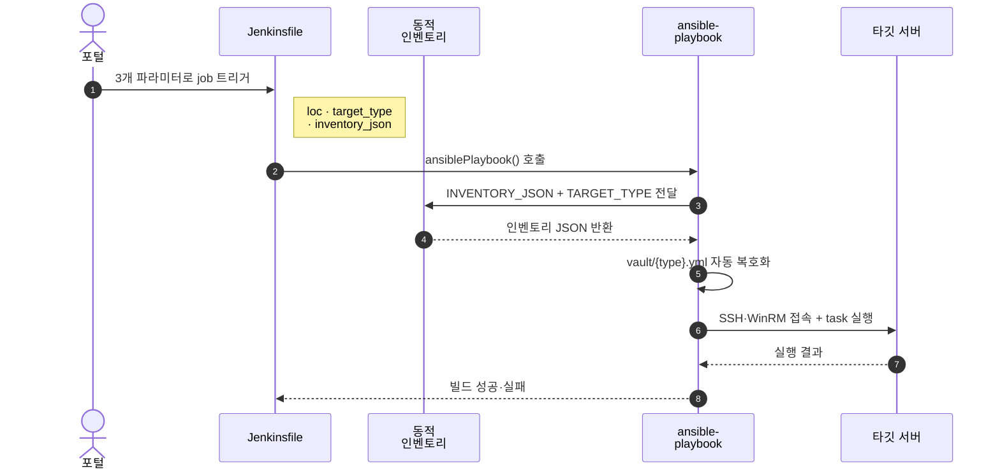

# Infrastructure Automation Project

**포털 → Jenkins → Ansible** 파이프라인의 컨벤션·예시·연습장을 한 곳에 모은 사내 가이드 저장소. 실제 운영 Playbook 은 별도 저장소에 두고, 여기는 **표준과 작동하는 템플릿** 만 유지한다.

대상 사용자:
- **새로 작업을 만드는 사람** — 가장 비슷한 `playbook/tasks/` 예시를 복사해 시작
- **Ansible / Jenkins 를 처음 접하는 사람** — `playbook/sandbox/` 의 본인 슬롯에서 실습
- **Agent 를 셋업하는 사람** — `docs/ansible-cfg-guide.md` 참고

## Quick Start

본인이 어느 그룹인지에 따라 30초 안에 시작할 수 있는 경로:

| 목적                              | 가장 먼저 볼 곳                                                 |
| :-------------------------------- | :-------------------------------------------------------------- |
| Ansible / Jenkins 손에 익히기     | [`playbook/sandbox/README.md`](playbook/sandbox/README.md) — linux 기준 2 stage 연습 슬롯 |
| 새 운영 작업 만들기               | [`playbook/README.md`](playbook/README.md) — 비슷한 작업 예시 고르기 |
| Ansible 문법 빠르게 복습          | [`playbook/patterns/README.md`](playbook/patterns/README.md) — roles / block-rescue / tags 데모 |
| Jenkinsfile 규칙·구조             | [`docs/jenkinsfile-guide.md`](docs/jenkinsfile-guide.md)        |
| Playbook 규칙·hostvars 사용법     | [`docs/playbook-guide.md`](docs/playbook-guide.md)              |
| Agent 한 번 셋업                  | [`docs/ansible-cfg-guide.md`](docs/ansible-cfg-guide.md)        |

## Prerequisites

이 저장소를 실제로 돌리려면 다음이 필요하다.

| 항목                         | 요구사항                                                       |
| :--------------------------- | :------------------------------------------------------------- |
| Jenkins                      | Pipeline + Ansible plugin (`ansiblePlaybook` 스텝) 설치        |
| Jenkins Credentials          | Secret text 1개 — ID `ansible-vault-password`                  |
| Agent OS                     | Linux (Ansible 컨트롤러 역할)                                  |
| ansible-core                 | 2.14 이상. Windows 타깃이면 2.20.x 권장                        |
| `sshpass`                    | password-based SSH / sudo 처리 (linux 타깃)                    |
| 타깃 OS                      | RHEL 9 (linux 예시 기준) / Windows Server (winrm 5985)         |

세부 셋업은 [`docs/ansible-cfg-guide.md`](docs/ansible-cfg-guide.md).

## 저장소 구조

```
.
├── docs/
│   ├── jenkinsfile-guide.md       Jenkinsfile 규칙
│   ├── playbook-guide.md          Playbook 규칙
│   └── ansible-cfg-guide.md       Agent 측 ansible.cfg 표준
├── playbook/
│   ├── tasks/                     실제 운영 작업 (Jenkinsfile + playbook + README 한 세트)
│   │   ├── linux/                 ntp, pkg-update, disk-check, baseline, sshd-safe-reload, nginx-healthcheck
│   │   └── windows/               service-check, sysinfo
│   ├── patterns/                  Ansible 문법 데모 (roles, block-rescue, tags) — 학습용
│   └── sandbox/                   연습 슬롯 user01~user10 (linux, 2 stage 템플릿)
├── inventory/
│   └── my_inventory.sh            동적 인벤토리 (포털 JSON → Ansible inventory)
├── credentials/                   평문 자격증명 원본 (사람이 편집)
├── vault/                         ansible-vault 암호화 자격증명 (런타임 사용)
└── scripts/
    ├── encrypt-vault.sh           credentials/ → vault/
    └── decrypt-vault.sh           vault/ → credentials/
```

## 실행 흐름



표로 보면:

| 단계 | 주체                          | 동작                                                                                                  |
| :--: | :---------------------------- | :---------------------------------------------------------------------------------------------------- |
| 1    | 포털                          | `loc`, `target_type`, `inventory_json` 세 파라미터로 Jenkins job 트리거                               |
| 2    | Jenkinsfile                   | 위 값을 환경변수로 노출하고 `ansiblePlaybook(vaultCredentialsId: ...)` 호출                           |
| 3    | `inventory/my_inventory.sh`   | `INVENTORY_JSON` + `TARGET_TYPE` 을 읽어 ansible 인벤토리 JSON 으로 변환                              |
| 4    | ansible-playbook              | `vars_files` 의 `vault/{target_type}.yml` 을 Jenkins 가 넘긴 vault 비밀번호로 자동 복호화             |
| 5    | playbook                      | `ansible_user` / `ansible_password` 로 타깃 서버에 SSH·WinRM·HTTPS 접속 후 task 실행                  |

## 새 작업 만들기

1. 가장 비슷한 [`playbook/tasks/`](playbook/tasks/) 디렉토리를 통째로 복사
2. 새 디렉토리에서 `Jenkinsfile` 의 `playbook:` 경로를 본인 디렉토리에 맞게 수정
3. 새 디렉토리의 `site.yml` (또는 `pre.yml` / `update.yml` / `post.yml`) 의 `tasks` 만 새 작업 내용으로 교체
4. `README.md` 도 새 작업 내용에 맞춰 갱신 (목적 / 보여주는 패턴 / task 흐름)

자세한 규칙·예시는 [`playbook/README.md`](playbook/README.md).

## 자격증명 초기 설정 (1회)

```bash
# 1. 평문 값 확인·수정
vi credentials/linux.yml

# 2. vault 암호화 (vault 비밀번호 입력)
./scripts/encrypt-vault.sh

# 3. commit
git add vault/
git commit -m "vault: encrypt"
git push
```

Jenkins UI → Manage Jenkins → Credentials → Global → Add:

| 항목   | 값                                            |
| :----- | :-------------------------------------------- |
| Kind   | Secret text                                   |
| ID     | `ansible-vault-password`                      |
| Secret | 위 2번에서 입력한 vault 비밀번호              |

세부 흐름은 [`credentials/README.md`](credentials/README.md), [`vault/README.md`](vault/README.md).

## 더 깊이 보기

- [`docs/`](docs/) — Jenkinsfile · Playbook · Agent ansible.cfg 표준 문서
- [`playbook/`](playbook/) — tasks / patterns / sandbox 모든 예시
- [`inventory/my_inventory.sh`](inventory/my_inventory.sh) — 동적 인벤토리 스크립트 (상단 docstring 에 입출력 예시)
